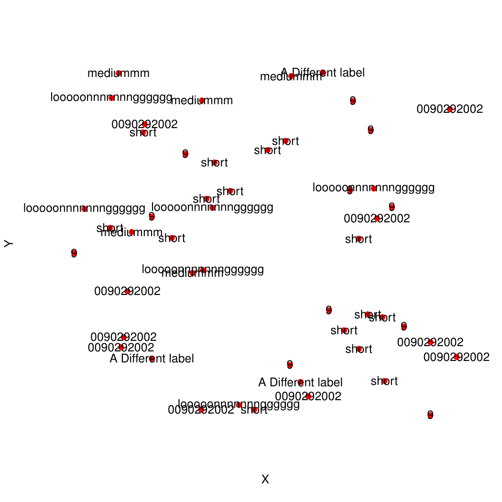

# addTextLabels
## Author: Joseph Crispell
## Repository created: 11-08-18
## Licence: GPL-3
An R package for add non-overlapping labels onto existing R plot

# CURRENTLY BROKEN :-( WORKING ON IT!!

Package can be directly installed into R using:
```
install.packages("devtools")
library("devtools")
install_github("JosephCrispell/addTextLabels")
library(addTextLabels)
```

Once installed test it out with the following code:
```
# Create some random points
n <- 50
coords <- data.frame(X=runif(n), Y=runif(n), Name="Test Label")

# Plot them without labels
plot(x=coords$X, y=coords$Y, pch=19, bty="n", xaxt="n", yaxt="n", col="red", xlab="X", ylab="Y")

# With potentially overlapping labels
plot(x=coords$X, y=coords$Y, pch=19, bty="n", xaxt="n", yaxt="n", col="red", xlab="X", ylab="Y")
text(coords$X, coords$Y, labels=coords$Name, xpd=TRUE)

# Plot them with non-overlapping labels
plot(x=coords$X, y=coords$Y, pch=19, bty="n", xaxt="n", yaxt="n", col="red", xlab="X", ylab="Y")
addTextLabels(coords$X, coords$Y, coords$Name, cex=1, col.label="black")

# Plot them with non-overlapping labels
plot(x=coords$X, y=coords$Y, pch=19, bty="n", xaxt="n", yaxt="n", col="red", xlab="X", ylab="Y")
addTextLabels(coords$X, coords$Y, coords$Name, cex=1, col.background=rgb(0,0,0, 0.75), col.label="white")
```


